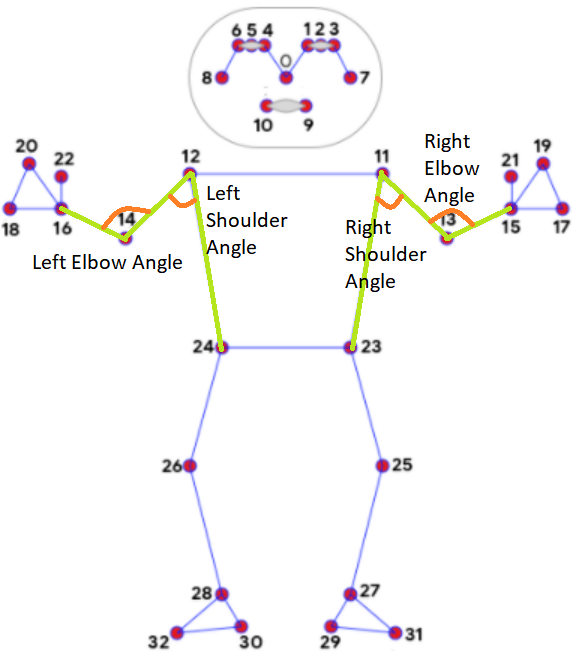
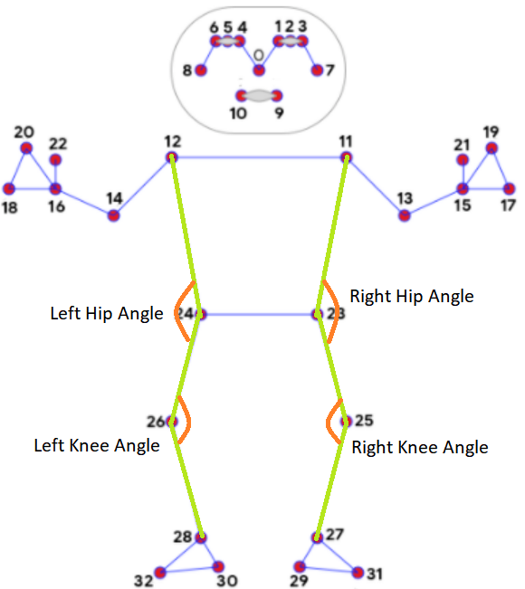

# Configuration File
- Author: Mike Smith
- Email: dongming.shi@uqconnect.edu.au
- Date of Implementation: 18/05/2023
- Status: Prototype
- Credits: Agnethe Kaasen, Live Myklebust, Amber Spurway

## Description

Contains angular and positional threshold values used to determine movement repetitions.

Contains thresholds for the following movements:
- Right arm extensions
- Left arm extensions
- Sit to stand

## Definitions

Angular Thresholds (degrees):

- Refers to the limit used to determine whether a change in angle surpasses a predefined threshold.
- Each angle is defined by three points with the centre point being where the angle is evaluated.
- One or more angular threshold can be used to define a movement.
- If multiple angular thresholds are defined, all must be satisfied for the movement to count.

Positional Thresholds (normalised pixel co-ordinates):

- Refers to the limit used to determine whether a change in relative positions surpasses a predefined threshold.
- Relative positions are defined by two points and the x or y distance between them. 
- Currently, only y-axis values are used to evaluate relative positions between points. So far, there has not been a need to use any x-axis values.
- One or more positional threshold can be used to define a movement.
- If multiple positional thresholds are defined, all must be satisfied for the movement to count.

## Chosen Thresholds

The chosen angular and positional thresholds are based on the physiological properties of the human anatomy. Chosen thresholds are tested extensively to provide the highest possible accuracy for the given movement while ignoring unintentional movements to avoid miscounts. A combination of multiple angular and positional thresholds can be used to define a specific movement. All threshold requirements must be satisfied for the movement to count.

### Arm Extensions [^2]
- wrist-elbow-shoulder angle: 130 degrees
- elbow-shoulder-hip angle: 30 degrees

 
[^1]

### Sit to Stand [^3]
- ankle-knee-hip angle: 150 degrees
- knee-hip-shoulder angle: 150 degrees
- y co-ordinates of knee and hip points are within a distance of "0.2 $\times$ frame hight" of each other OR knee point is positionally higher than the hip point.


[^1]

## Example Usage

```
EXAMPLE_ANGULAR_THRESH = [
    (<point_1>, <point_2>, <point_3>, <angluar_threshold_1>),
    (<point_4>, <point_5>, <point_6>, <angluar_threshold_2>),
    ...
]

EXAMPLE_POSITIONAL_THRESH = [
    (<point_1>, <point_2>, ">" or "<", <positional_threshold_1>),
    (<point_3>, <point_4>, ">" or "<", <positional_threshold_2>),
    ...
]
```

[^1] Google (2023) Mediapipe/pose.md at master · google/mediapipe, GitHub. Available at: https://github.com/google/mediapipe/blob/master/docs/solutions/pose.md (Accessed: 24 May 2023)

[^2]: Elbow range of motion: How to measure &amp; improve elbow movement (nd.) Available at: https://www.shoulder-pain-explained.com/elbow-range-of-motion.html#:~:text=What%20is%20this%3F,-Report%20Ad&amp;text=At%20the%20elbow%20joint%2C%20most,extension%20to%20130o%20flexion (Accessed: 24 May 2023)

[^3]: Hiroshi R Yamasaki (nd.) Definition of segment/joint angles and coordinates - researchgate. Available at: https://www.researchgate.net/figure/Definition-of-segment-joint-angles-and-coordinates_fig1_325552552 (Accessed: 24 May 2023)